# SOC476 Project on Gender Inequality across different countries
## Analysis
We have analyzed the Follwing Indicators:
- Hypertension of adults(30 to 79 years)
- Skill Level vs Pay Gap
- Occupation vs Pay Gap
- Obesity of above 18 years
- Uneducation
- HIV Infections
## Few Plots from the analysis:
1. Rwanda
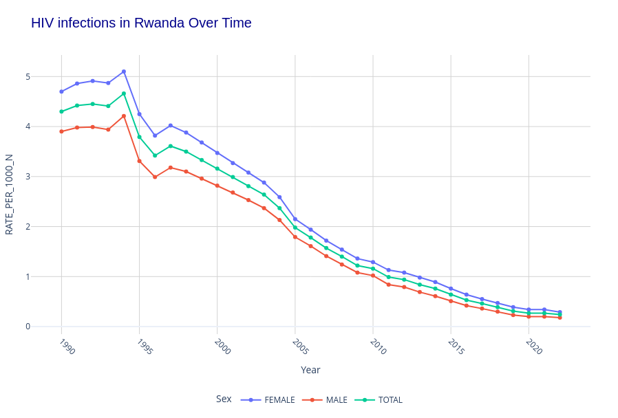
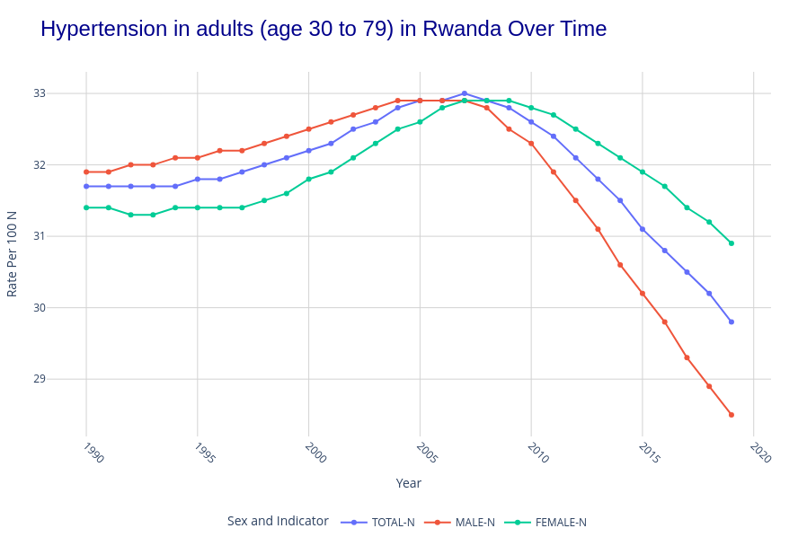
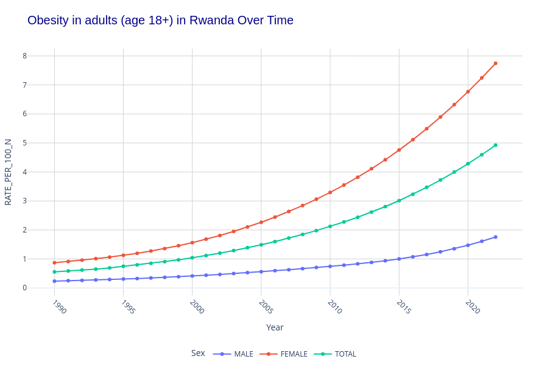
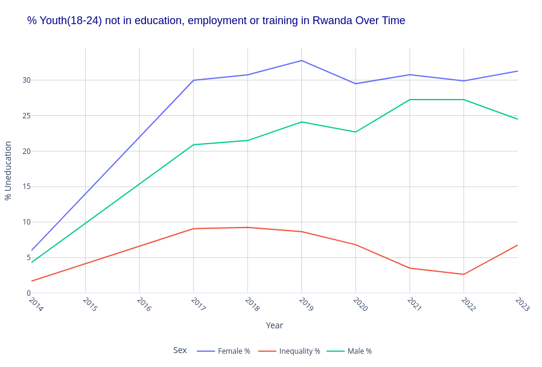
2. United States
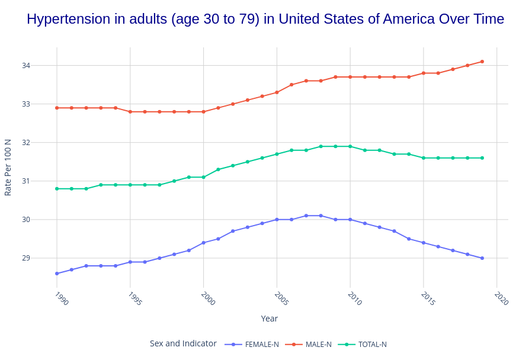
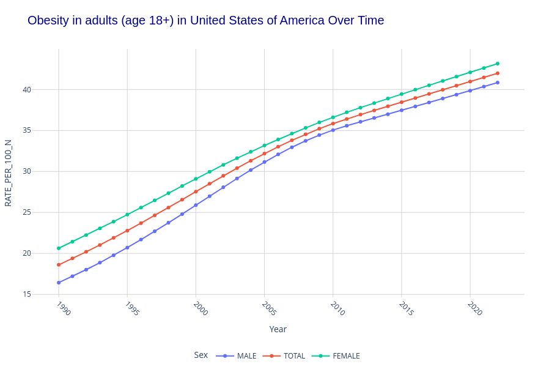
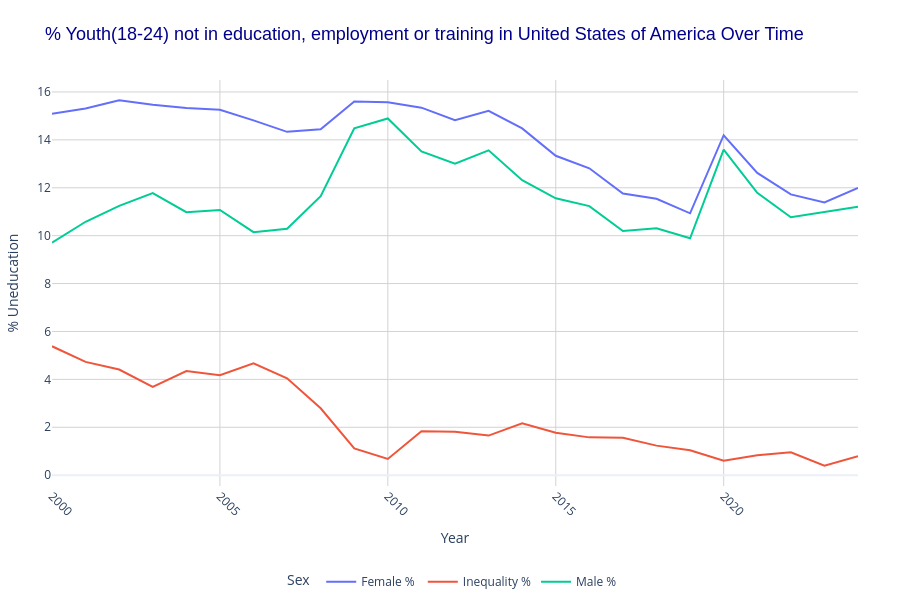
3. Bangladesh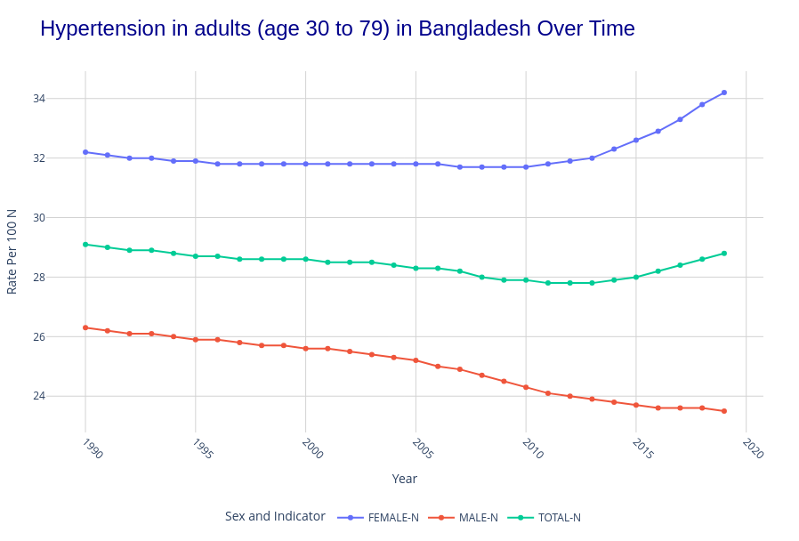
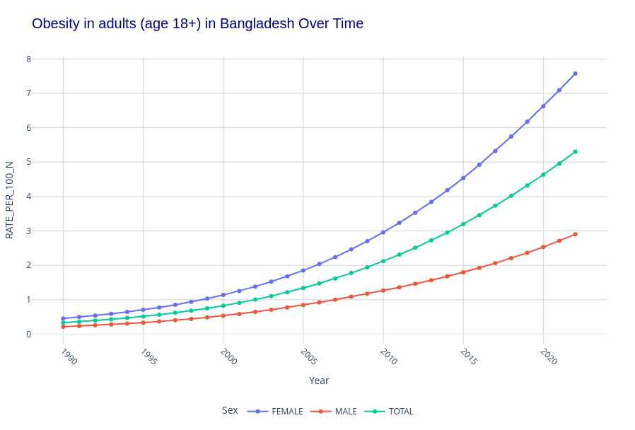
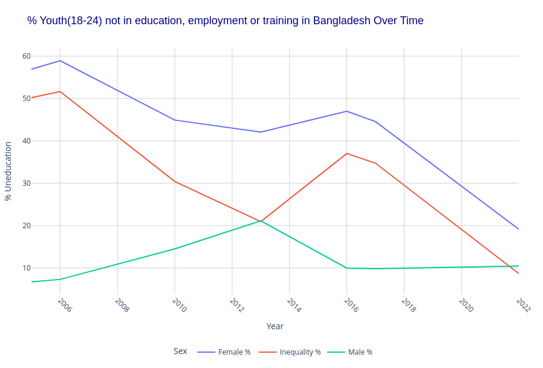
## Results of the project
[Results_Folder](Results) Contains the results of the project in the form of graphs in html format.

**Example:**

To view the results,of Hypertenstion in Australia, 

- go to the file [Results/Hypertension/Australia.html](Results/Hypertension/Australia.html)
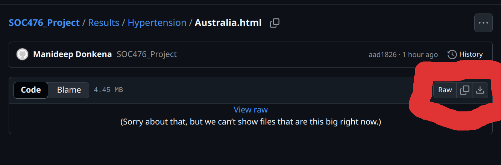
- download the file and open it in a browser.

